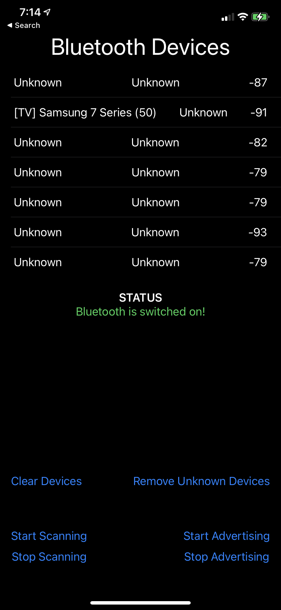

# DemoBluetooth
This repo contains an iOS App which uses CoreBluetooth to scann for Bluetooth devices and displays found devices in a list. Most of it was built off of this [tutorial](https://www.novelbits.io/intro-ble-mobile-development-ios-part-2/)

